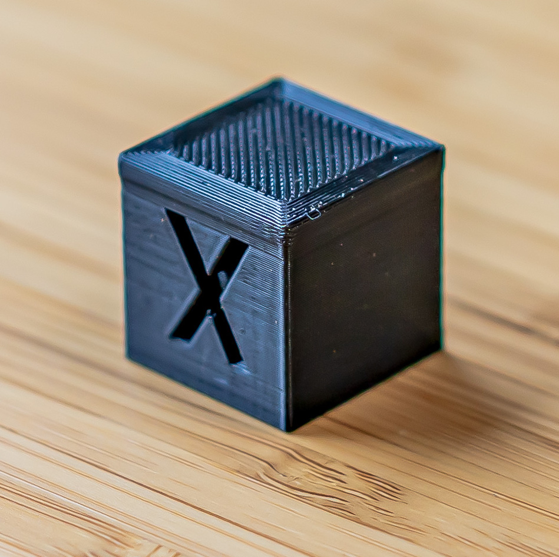
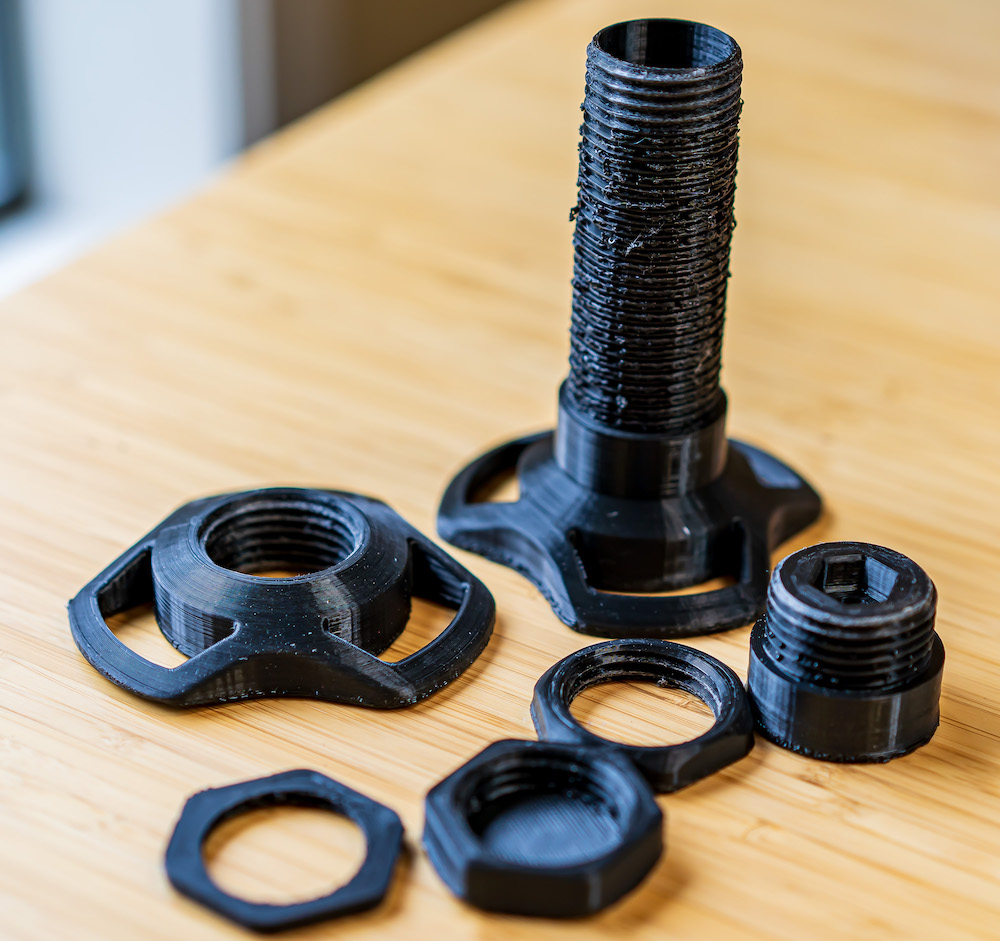

## Starting the 3D Printer Journey

The two things that really inspire me are exploring and creating. Exploring can be traveling or doing something new, trying something out. Creating is about making something new. For me, this usually means either modifying something that already exists (improving) or building together something with exciting pieces. As a kid, I loved legos, and legos are how I think about creating. Legos pieces can be code, computer chips, or kitchen cabinets. I don't like reinventing the wheel. Sometimes, the lego piece I need does not exist, so I need to make it. The 3D printer fits in many of these places. I have wanted to get into 3D printers for a while, but I have not had the time since it takes time to figure it out. IT is not as easy as printing a piece of paper. Due to life circumstances, I needed a distraction, so I finally decided to buy a beginner 3D printer and start the learning process.

## Picking a Printer

I narrowed my decision down to the [Prusa i3 MK3S+](https://www.prusa3d.com/product/original-prusa-i3-mk3s-3d-printer-3/) and the [Ender 3 v2](https://www.creality.com/goods-detail/ender-3-v2-3d-printer). The Prusa (kit version) is $500 more and ships in 4-6 weeks. The Ender 3 v2 is at [Amazon](https://smile.amazon.com/gp/product/B07FFTHMMN/ref=ppx_yo_dt_b_asin_title_o09_s02?ie=UTF8&psc=1) and has 2-day shipping (Prime) $270. I wanted to work on it now, so I picked the Ender. I also order the [CR Touch Bed leveling sensor](https://smile.amazon.com/gp/product/B0995H2X92/ref=ppx_yo_dt_b_asin_title_o09_s01?ie=UTF8&psc=1) for $40. After receiving the printer, the next step was to assemble it.

## Setting Up the Printer

I use [this video](https://www.youtube.com/watch?v=gokN9xNG94U&t=2710s) from [https://www.youtube.com/channel/UC3Gh-hVVdZXDuTMNlqyHYBw](https://www.youtube.com/channel/UC3Gh-hVVdZXDuTMNlqyHYBw) to assemble.

After making my first print, a [https://www.thingiverse.com/thing:1278865](https://www.thingiverse.com/thing:1278865), I used several youtube videos to add the CR touch. Most of the videos were good for learning how to add the CR Touch. After the CR Touch was added, I had to update the firmware on the Touchscreen and the firmware for the printer. I [downloaded](https://www.creality.com/download) default firmware from Creality for the touchscreen. There are a lot of firmware options for the printer, so I picked [Jyers firmware](https://github.com/Jyers/Marlin/releases) with the BL-Touch 5x5 option. I will need to research more about firmware options later.

## Adding Upgrades

After the assembly was done, I started printing parts to move the print spool from the top to the side. The print spool on the top seems less stable and the filament is also not well aligned. I used [Side Spool Mount](https://www.thingiverse.com/thing:4691695) from Thingiverse to move it and everything worked well. The next was to add a smoother spool holder with ball bearings with this [Ball Bearing Spool Holder](https://www.thingiverse.com/thing:4208201/files). It tried to print all parts at one time, but I have bed adhesion issues with some parts. So I switch to printing one at a time. I also added [Flexible Removable PEI Steel Sheet Bed](https://smile.amazon.com/gp/product/B08DNCK7P2/ref=ppx_yo_dt_b_asin_title_o06_s00?ie=UTF8&psc=1) to see if that helps and to make it easier to remove parts. I am not sure if I need this, but I will test this with the original bed in time. I had more adhesion issues before the new bed and I found out I was not pre-heating the bed enough. So now I pre-heat the printer heat to 210 and the bed to 60 for 5-10 minutes if cold before starting to print. I am doing this to make sure everything is nicely heated before printing. So far this is working.

## Next Steps

I was able to print all of the spool holder parts, but some of the parts are accurate. Some of the threads work (the big one) and some are oblong. Also, the big thread part is not very clean. After researching more, I found a [site](https://teachingtechyt.github.io/) to calibrate the printer. That is my next step.
