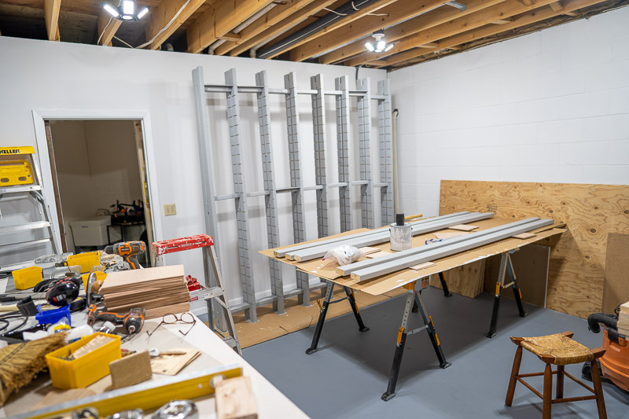
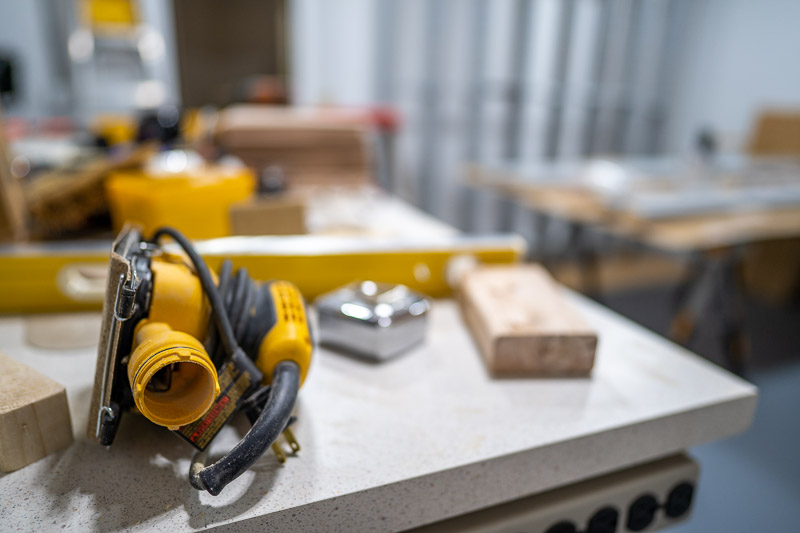
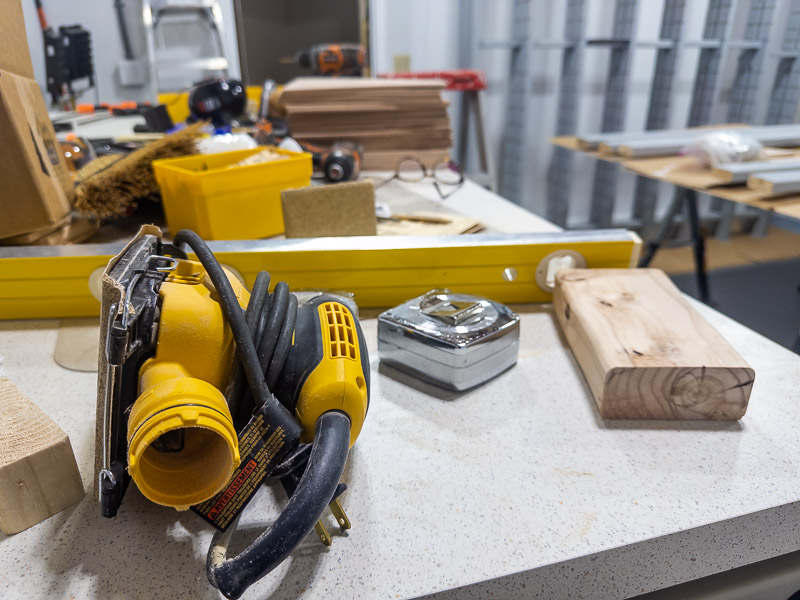

## Workshop build

We started the workshop build a couple of weeks ago by painting the floor and walls. The next step was to build the shelves for small parts. The pictures show the frame of the shelves in the process of being painted. When the painting is done, I will attach it to the wall. There is plenty of medium and large shelving by the workbench and in the room next to the workshop (the storage room). I am also starting the workbench on the wall to the left. More to come.

## Photography

Do add a little photography to this post. The following depth of field pictures were taking from my Sony a7c and Apple iPhone 14.

